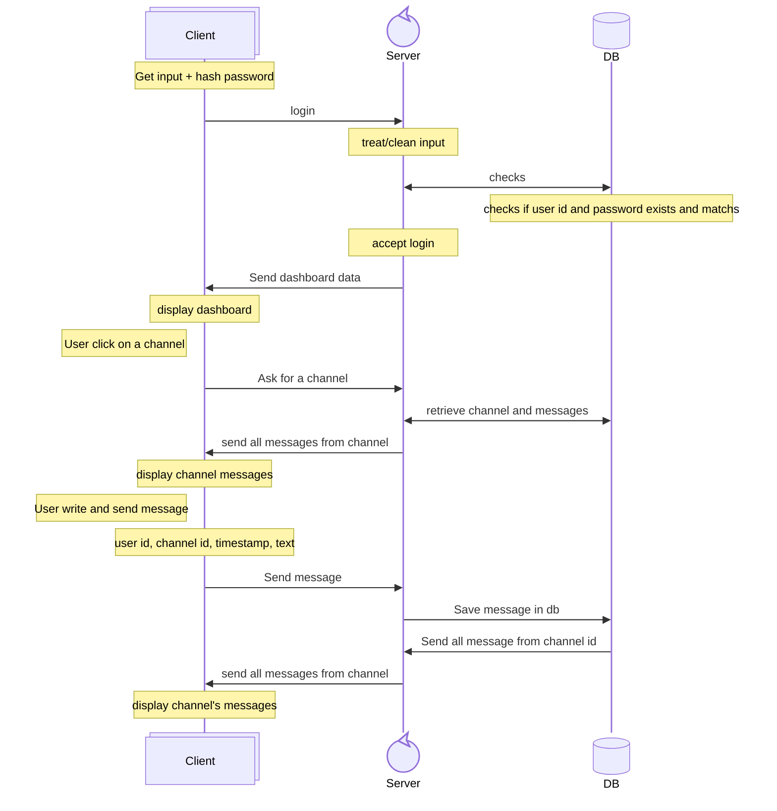
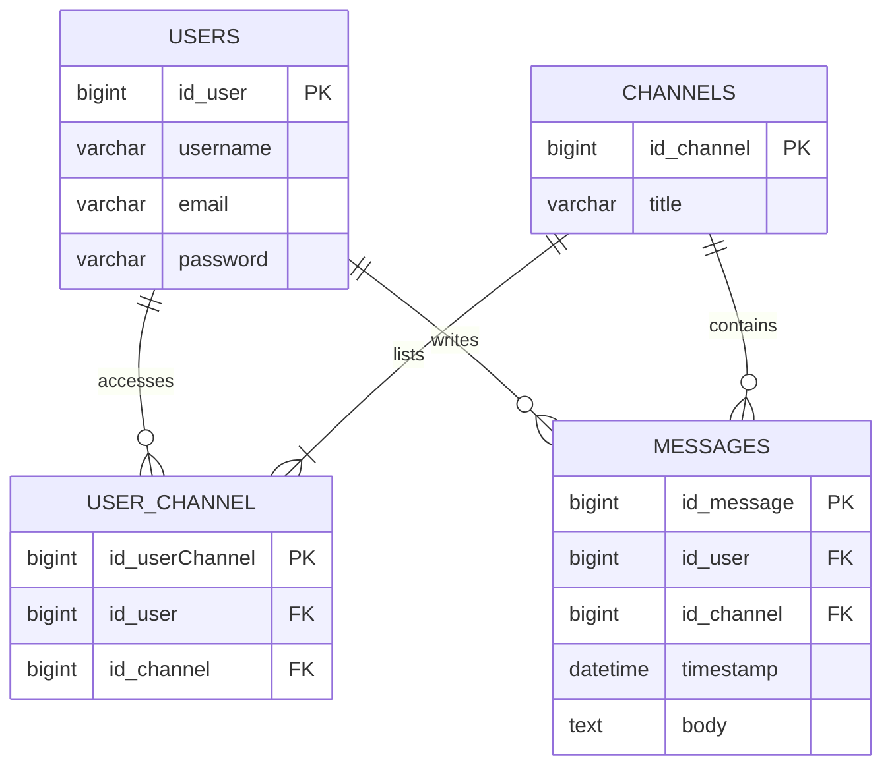

# wizzMania
Second year IT Bachelor group project : create a chat application with C++ and Qt

## 🔁 Flow : Sequence diagram
Flow of login to sending a message. Only one server, one DB and possible multiple clients

##  🗄️ Database : Physical Data Model

