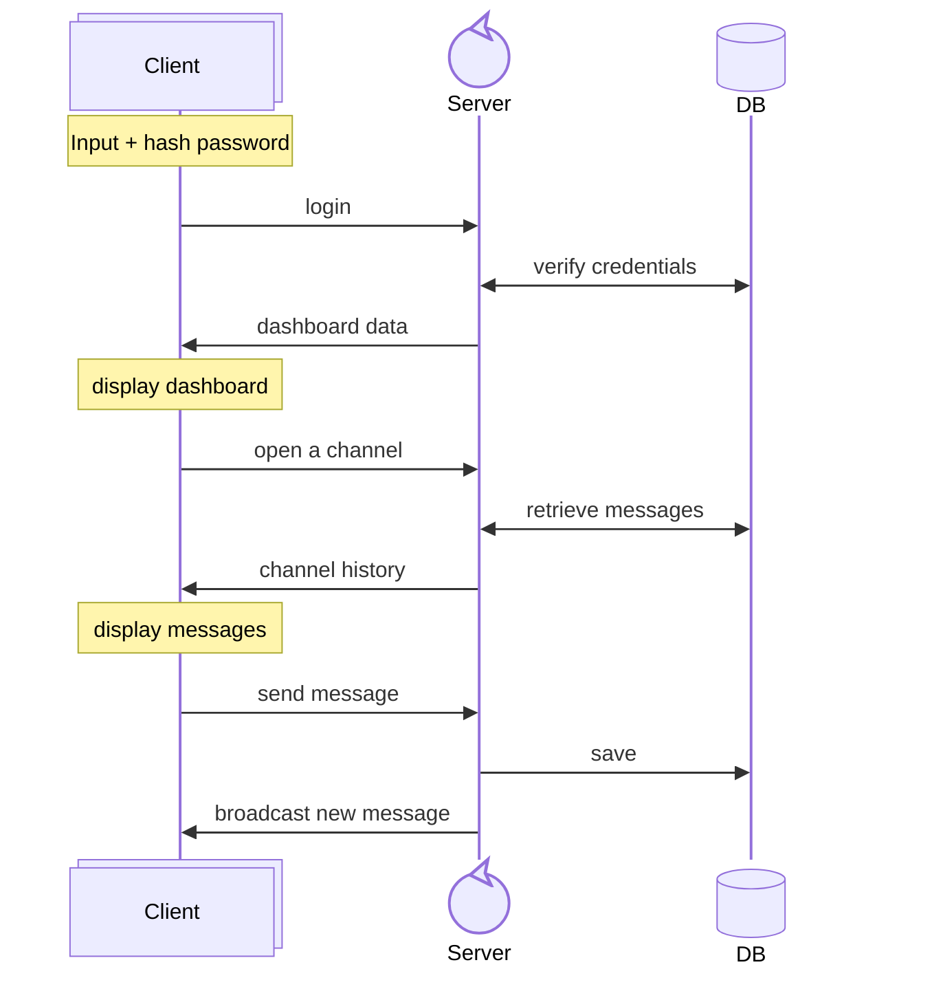
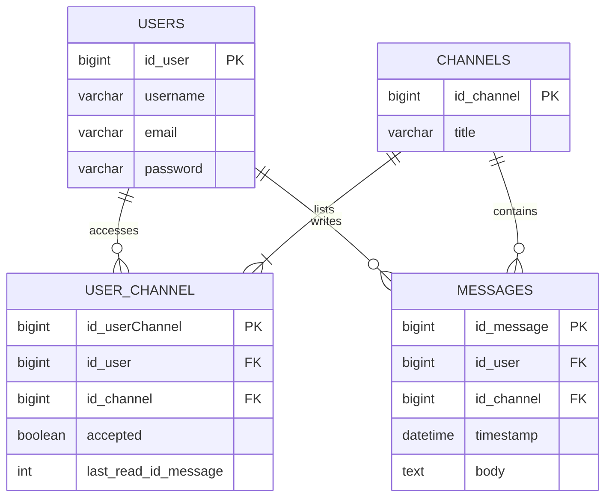

# 🧙 WizzMania

> **Group project — 2nd year IT Bachelor**
> Real-time chat application built with C++ and Qt, inspired by MSN Messenger.


---

## 📋 Table of Contents

- [Architecture](#-architecture)
- [Prerequisites](#-prerequisites)
- [Launch the project](#-launch-the-project)
- [Build & run client](#-build--run-client)
- [Testing](#-testing)
- [Design](#-design)
- [Diagrams](#-diagrams)
- [Documentation](#-documentation)

---

## 🏗 Architecture

```
wizzMania/
├── server/          → C++ server (Crow + WebSocket) — Dockerized
├── client/          → Qt6 client (Widgets + WebSocket)
├── common/          → Shared code (types, messages, utils)
├── docs/            → Backend technical documentation
├── assets/          → Project screenshots
├── tests/           → Server tests + debug web client
├── conception/      → Diagrams and brainstorming
├── docker-compose.yml
├── Dockerfile.server
└── init.sql         → Database schema
```

**Stack:** C++17 · Crow v1.3.0 · Qt 6 · MySQL 9 · Docker · JWT · WebSocket

---

## ⚙ Prerequisites

- **Docker & Docker Compose** (server + database)
- **Qt 6** with CMake and MinGW/GCC (client)
```

Create a `.env` file at the root from the template:

```bash
cp .env.template .env
```

---

## 🚀 Launch the project

```bash
cp .env.template .env   # configure variables
docker compose up --build
```

> The server listens on `http://localhost:8888`

> For all Docker commands (logs, rebuild, database reset, troubleshooting), see the [technical documentation](docs/backendFrontEnd_api.md#docker-commands).

---

## 🖥 Build & run client

### Windows (Git Bash)

```bash
cmake -S client -B client/build -G "MinGW Makefiles" -DCMAKE_BUILD_TYPE=Debug
cmake --build client/build -j4
./client/build/wizzmania-client.exe
```

> Requires Qt 6 installed with `C:\Qt\Tools\QtCreator\bin` and `C:\Qt\6.x.x\mingw_64\bin` in your PATH.

### Windows (PowerShell)

```powershell
.\client\build-client.bat
.\client\build\wizzmania-client.exe
```

### Linux / WSL

```bash
sudo apt install -y cmake g++ qt6-base-dev qt6-websockets-dev
mkdir -p client/build && cd client/build
cmake ..
make -j$(nproc)
./wizzmania-client
```

> **WSL:** if you get EGL/MESA errors, add `export LIBGL_ALWAYS_SOFTWARE=1` to your `~/.bashrc`

### Filter client logs

```bash
# Without Qt noise
QT_LOGGING_RULES="qt.*=false" ./wizzmania-client

# Full debug mode
QT_LOGGING_RULES="*.debug=true;*.info=true;qt.network.*=true" ./wizzmania-client

# Silent
QT_LOGGING_RULES="*=false" ./wizzmania-client
```

---

## 🧪 Testing

### Test the server with curl

```bash
# Login
curl -X POST http://localhost:8888/login \
  -H "Content-Type: application/json" \
  -d '{"username":"alice","password":"hash"}'

# Create an account
curl -X POST http://localhost:8888/register \
  -H "Content-Type: application/json" \
  -d '{"username":"newuser","email":"new@mail.com","password":"Test123!"}'

# Delete an account (authenticated)
curl -X DELETE http://localhost:8888/account \
  -H "X-Auth-Token: <TOKEN>"
```

### Debug web client

```bash
python3 -m http.server 8880
```

Then open `http://localhost:8880/tests/draft/index.html`

> Requires a `secret.js` file in the same folder as `index.js`

---

## 🎨 Design

| Role               | Color                                                              |
| ------------------ | ------------------------------------------------------------------ |
| Background         |  `#00111a` |
| Background Light   |  `#001824` |
| Input / Message BG |  `#001b29` |
| Separator          |  `#003047` |
| Button / Hint      |  `#003d5c` |
| Text               |  `#427E9D` |
| Green              |  `#52864d` |
| Pink               |  `#c0899d` |

---

## 📊 Diagrams

### Flow: Login → Message



### Database



---

## 📖 Documentation

- **[Backend & Frontend API](docs/backendFrontEnd_api.md)** — Full documentation of endpoints and WebSocket messages
- **[Client Architecture](client/_documentation/architecture.md)** — Qt client structure
- **[Client Data Flow](client/_documentation/data_flow.md)** — Client-side data flow

---

## 🔧 Dependencies

| Library                                       | Version | Usage                                  |
| --------------------------------------------- | ------- | -------------------------------------- |
| [Crow](https://github.com/CrowCpp/Crow)       | v1.3.0  | HTTP + WebSocket server framework      |
| [Asio](https://github.com/chriskohlhoff/asio) | 1.28.0  | Asynchronous I/O (Crow dependency)     |
| [Qt 6](https://www.qt.io/)                    | 6.4+    | Client framework (Widgets + WebSocket) |
| MySQL                                         | 9.6     | Database                               |
| JWT                                           | —       | Token-based authentication             |

Server dependencies are managed as **git submodules**:

```bash
git submodule update --init --recursive
```

---

This project was made by:

- [Thibault Caron](https://github.com/thibault-caron)
- [Adeline Patenne](https://github.com/AdelinePat/)
- [Florence Navet](https://github.com/florence-navet)
