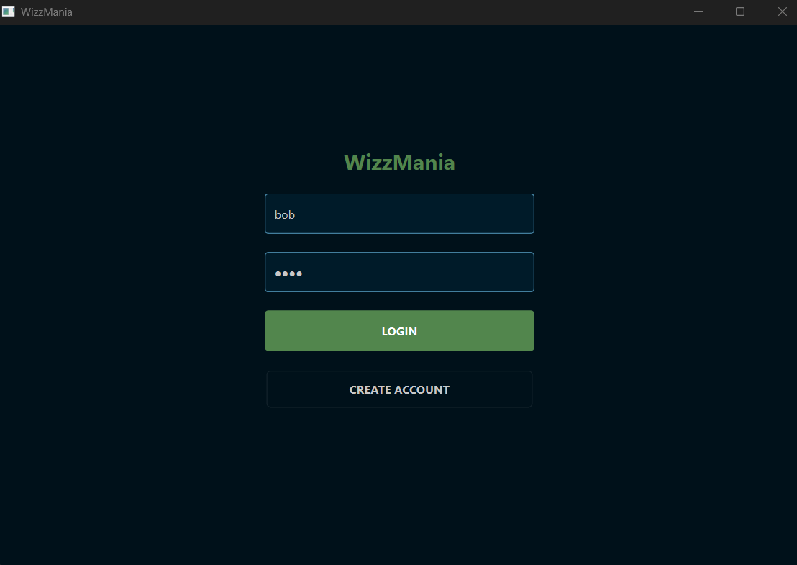
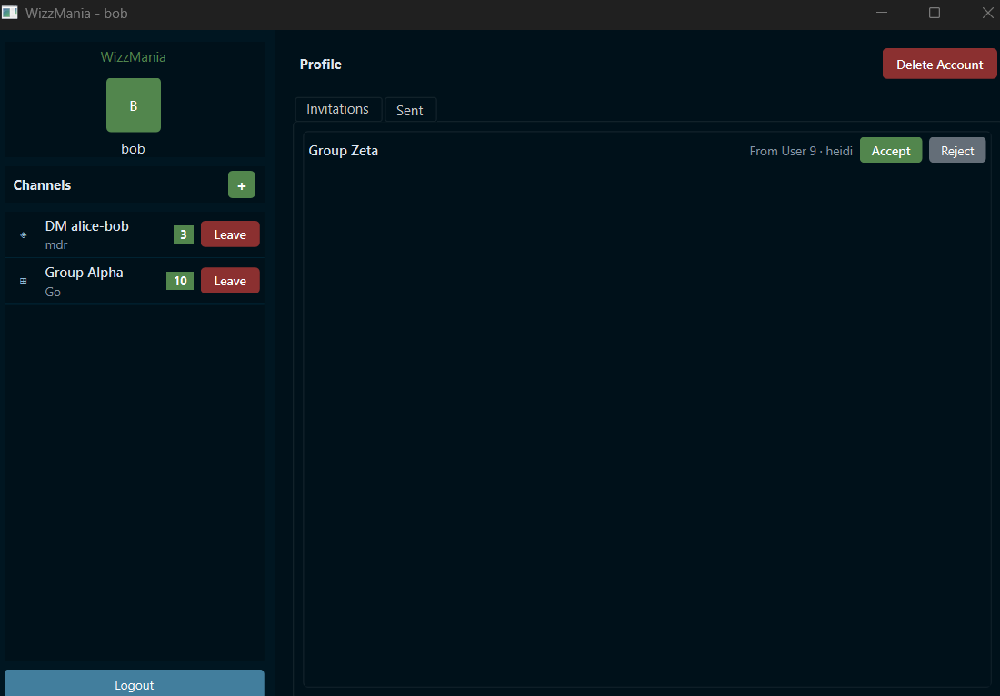
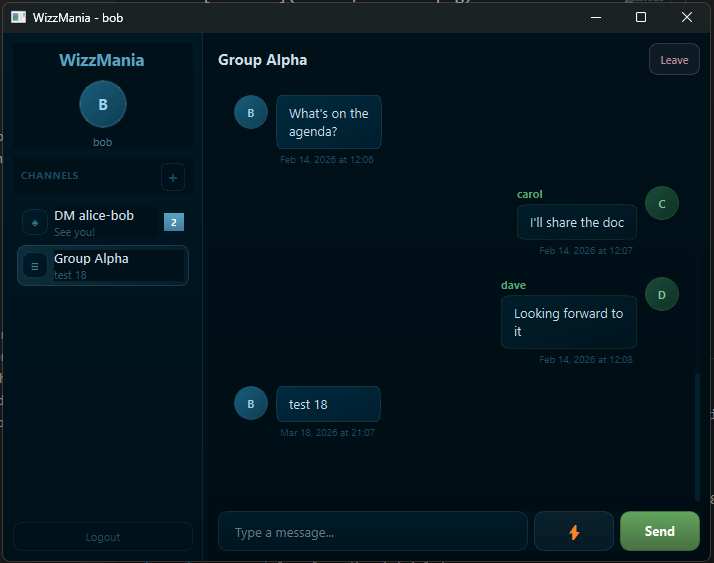
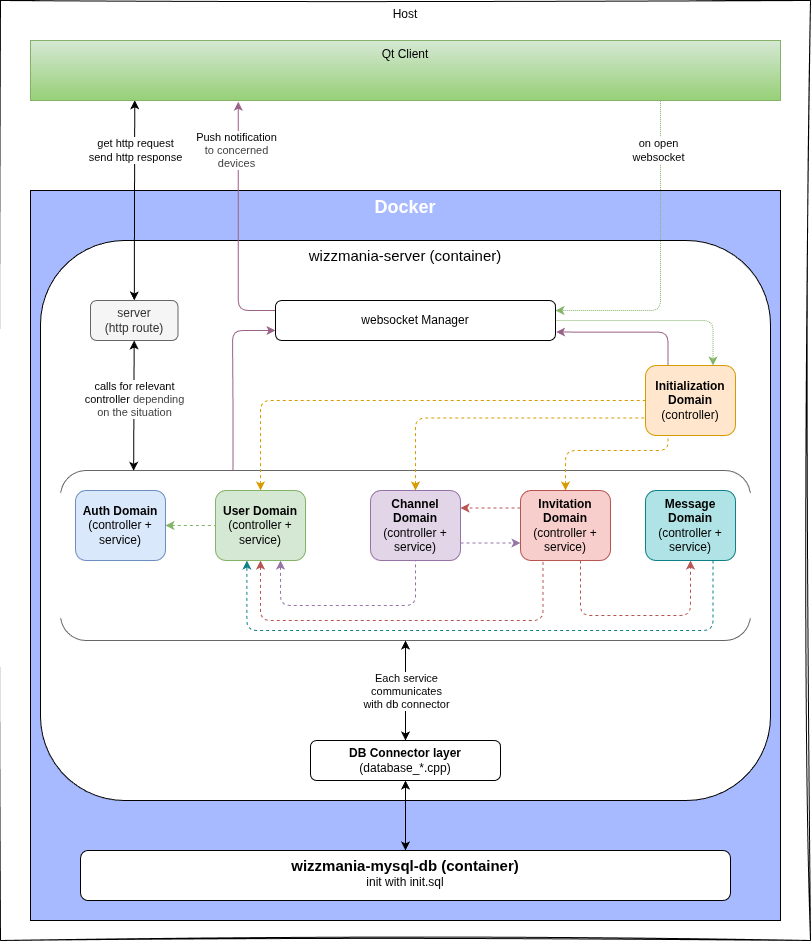

# WizzMania 💬

> **2nd year IT Bachelor — group project**
> A real-time chat application built with C++ (server) and Qt (client), inspired by MSN Messenger (Wizz feature).





---

## 📋 Table of Contents

- [Features](#features)
- [Tech Stack](#tech-stack)
- [Architecture](#architecture)
- [Project Structure](#project-structure)
- [Dependencies](#dependencies)
- [Getting Started](#getting-started)
  - [Environment setup](#environment-setup)
  - [Server](#server-windows--linux)
  - [Client - Windows](#client-windows)
  - [Client - Linux](#client-linux)
- [API & Endpoints](#api--endpoints)
- [Development](#development)

---

## Features

- User registration and login with JWT authentication
- Direct messages between users
- Group channels
- Channel invitations — accept, reject or cancel
- Real-time messaging via WebSocket
- Message history per channel
- Unread message count tracking per channel
- Delete account
- Wizz

---

## Tech Stack

| Layer | Technology |
|---|---|
| Server build & runtime | Docker & Docker Compose |
| Server | C++17 with [Crow](https://github.com/CrowCpp/Crow) v1.3.0 (HTTP + WebSocket) |
| Client | Qt 6.4.2 minimum, 6.10.2 recommended (Widgets + WebSocket) |
| Database | MySQL 9.6.0 |
---


## Architecture



The Qt client runs on the **host machine**. The server and the database each run in their own **Docker container**, on the same Docker network — so the server reaches the DB using the container name as hostname, no IP needed.

The client communicates with the server over two channels:
- **HTTP** — for spontaneous one-off actions and client request to change DB state.
- **WebSocket** — for everything real-time (push notification for other concerned devices)

Every action goes through **token authentication first**, then an **access check** before anything is processed.


## Project Structure

```
wizzMania/
├── server/          → C++ server, DDD architecture (7 domains)
├── client/          → Qt6 client
├── common/          → Shared message types and structures (client ↔ server)
├── tests/           → Server unit tests + debug web client
├── docs/            → API documentation
├── docker-compose.yml
├── Dockerfile.server
├── init.sql         → Database schema + seed data
└── .env.template    → Environment variable template
```

### Server architecture

The server follows a **Domain-Driven Design (DDD)** approach, organized into 7 domains:

`auth` · `channel` · `invitation` · `message` · `user` · `initialization` · `websocket`

Each domain has its own controller and service. Some controllers call across services when needed.

### The `common/` folder

`common/` holds the message types and structures exchanged between the client and the server (over HTTP and WebSocket). This keeps both sides in sync and lets the client and server teams work independently without breaking the protocol.
It also contains pure C++ helpers that can be needed on both sides.

---

## Dependencies

All **server-side dependencies** are handled automatically inside the Docker container (using `ubuntu:22.04` image) — nothing to install on your machine for the server.

All **client-side dependencies** need to be installed on your host machine (see [Getting Started](#getting-started) below).

| Library | Version | Where | Purpose |
|---|---|---|---|
| [Crow](https://github.com/CrowCpp/Crow) | v1.3.0 | Server (Docker) | HTTP and WebSocket framework |
| [jwt-cpp](https://github.com/Thalhammer/jwt-cpp) | v0.7.0 | Server (Docker) | JWT token creation and validation |
| [nlohmann/json](https://github.com/nlohmann/json) | v3 | Server (Docker) | JSON serialization/deserialization |
| [libbcrypt](https://github.com/trusch/libbcrypt) | no releases — commit `d6523c3` (Jun 22, 2021) | Server (Docker) | bcrypt password hashing |
| Boost | system | Server (Docker) | Async I/O (required by Crow) |
| libmysqlclient-dev | system | Server (Docker) | Low-level C library to connect and send queries to MySQL |
| mysql-client | system | Server (Docker) | MySQL CLI tools — useful for debugging inside the container |
| libmysqlcppconn-dev | system | Server (Docker) | Official C++ wrapper over libmysqlclient — this is what the server code uses directly |
| Google Test / Mock | system | Server (Docker) | Unit testing framework |
| CMake | — | Client (host) | Build system for the Qt client |

> **Note on libbcrypt:** this library has no official releases or tags. The server was built and tested against commit `d6523c370de6e724ce4ec703e2449b5b028ea3b1` (June 22, 2021). If the build breaks in the future, check that commit or update the `Dockerfile.server` accordingly.

> **Note on MySQL libraries:** `libmysqlclient-dev` is the C foundation, `libmysqlcppconn-dev` is the C++ layer your server code actually talks to, and `mysql-client` is just a convenience tool for manual DB access inside the container.

---


## Getting Started

### Environment setup

A `.env.template` file is provided. Copy it and fill in your values before doing anything else:

```bash
cp .env.template .env
```

Key variables to know:

| Variable | Default | Required | Description |
|---|---|---|---|
| `MYSQL_ROOT_PASSWORD` | — | ✅ | Root password for the MySQL container. Only used internally by MySQL, not by the server. |
| `MYSQL_DATABASE` | `wizzmania` | ✅ | Name of the database that will be created and used by the server. |
| `MYSQL_USER` | `wizzuser` | ✅ | MySQL user the server connects as. |
| `MYSQL_PASSWORD` | — | ✅ | Password for `MYSQL_USER`. All four `MYSQL_*` variables must be set or the DB container will fail to start. |
| `DB_PORT` | `3306` | ✅ | MySQL port exposed on your host. Change it if you already have a local MySQL running on 3306. |
| `SERVER_PORT` | `8888` | ✅ | Port the C++ server listens on (also exposed by Docker). |
| `SERVER_IP` | `127.0.0.1` | — | IP the client uses to reach the server. Keep as localhost for local development. |
| `SECRET_KEY` | — | ⚠️ | Secret used to sign JWT tokens. If left empty, the server falls back to `default_secret` (defined in `auth_service.hpp`) — **always set this in production**. |

> ⚠️ All four `MYSQL_*` variables must be set or the database container will fail to start — and since the server depends on it, it will fail too.

---

### Server (Windows & Linux)

#### Windows
1. Install and start **Docker Desktop**

#### Linux
1. Make sure Docker is installed

#### Both
2. Make sure your `.env` is ready and run:
```bash
docker compose up
```

That's it. Docker Compose will:
- Start the MySQL container and initialize the database from `init.sql`
- Build the server container, run the tests, and if they pass — build and start the server

> ⚠️ If any test fails, the server will not start. Check the logs with `docker compose logs -f server`.

---

### Client (Windows)

First, check if you already have the required tools:

```bash
qmake6 --version && cmake --version
```

If anything is missing, you have two options:

**Option A — via WSL (Windows Subsystem for Linux):**

```bash
sudo apt install qt6-base-dev qt6-base-dev-tools
sudo apt install cmake
```

**Option B — via the Qt official installer:**

Download Qt from [https://www.qt.io/download-open-source](https://www.qt.io/download-open-source) (free community version, account required).
Install `Qt` with `gcc`, `g++` and `cmake` to avoid path issues.
Qt **6.4.2 minimum**, **6.10.2** was used for development.

Then add these to your `PATH`:

```
C:\Qt\Tools\QtCreator\bin
C:\Qt\6.x.x\mingw_64\bin
```

**Build the client:**

From **PowerShell**:
```powershell
./client/build-client.bat
```

From **Git Bash**:
```bash
powershell.exe -NoProfile -Command "& '$(cygpath -w ./client/build-client.bat)'"
```

**Run the client:**

```bash
./client/build/wizzmania-client.exe
```
> **WSL:** if you get EGL/MESA errors, add `export LIBGL_ALWAYS_SOFTWARE=1` to your `~/.bashrc`
---

### Client (Linux)

Check your tools first:

```bash
qmake6 --version && cmake --version
```

Install if needed:

```bash
sudo apt install qt6-base-dev qt6-base-dev-tools
sudo apt install cmake
```

Make the scripts executable (only needed once):

```bash
chmod +x ./client/build-client.sh
chmod +x ./client/run-client.sh
```

Build then run:

```bash
./client/build-client.sh
./client/run-client.sh
```

**WSL only:** if you get EGL/MESA rendering errors, add this to your `~/.bashrc` and restart your terminal:
```bash
export LIBGL_ALWAYS_SOFTWARE=1
```
> WSL has no GPU access, so Qt's hardware OpenGL rendering fails. This flag forces software rendering instead.

---

## API & Endpoints

All available HTTP routes and WebSocket message types are documented in [`/docs/API.md`](./docs/backend_API.md).

Refer to it to test the project manually or understand the client ↔ server protocol.

---


## Development

### Filtering Qt client logs

Useful when actively working on the client — not needed just to run the project.
```bash
# Suppress Qt internals, keep your app logs
QT_LOGGING_RULES="qt.*=false" ./wizzmania-client

# Full debug output
QT_LOGGING_RULES="*.debug=true;*.info=true;qt.network.*=true" ./wizzmania-client

# Silent (no logs at all)
QT_LOGGING_RULES="*=false" ./wizzmania-client
```

---

This project was made by:

- [Adeline Patenne](https://github.com/AdelinePat/)
- [Thibault Caron](https://github.com/thibault-caron)
- [Florence Navet](https://github.com/florence-navet)