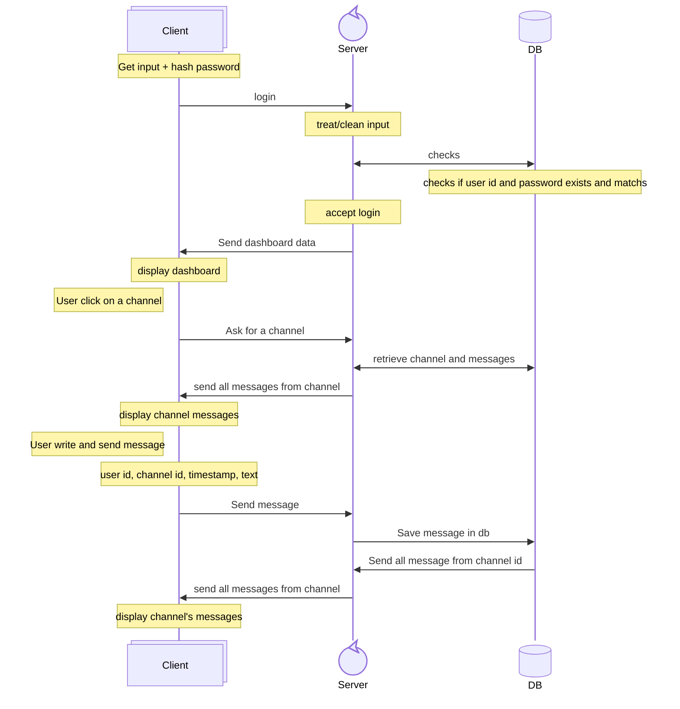

# wizzMania
Second year IT Bachelor group project : create a chat application with C++ and Qt

## Build & run client app

```cmd
cd client/build
cmake .. -G Ninja -DCMAKE_PREFIX_PATH="C:/Qt/6.10.1/mingw_64"
ninja
./wizzmania-client.exe
```

## Design
### Main colors
-  `Background: #00111a`
-  `Background-Light: #001824`
-  `Login input background / Background-Message : #001b29`
-  `Separator : #003047`
-  `Background-Button / Text-Hint: #003d5c`
-  `Text: #427E9D`
-  `Green: #52864d`
-  `Pink: #c0899d`

## 🔁 Flow : Sequence diagram
Flow of login to sending a message. Only one server, one DB and possible multiple clients


##  🗄️ Database : Physical Data Model
<!-- manque le status pour demande d'amis -->


## Creation of environment
The environment consist on 3 part :
- Server (headless) : combile build and run in a container
- Database : run in a container, communicate directly with server through docker network using container name to get IP adress
- Client : tests run in container if passed, cross compiled to build a .exe for windows

## Dependencies
### 1. Crow -  [ https://github.com/CrowCpp/Crow](https://github.com/CrowCpp/Crow)
Use of `Crow v1.3.0` for WebSocket (server side) 
In order to get crow working, got it as a vendor inside project directly using this command
```bash
curl -L https://github.com/CrowCpp/Crow/archive/refs/tags/v1.3.0.tar.gz \
  | tar -xz
```
### 2. Asio - [https://github.com/chriskohlhoff/asio](https://github.com/chriskohlhoff/asio)
As Crow depends on `Asio 1.28.0`  the same was done for it too 
```bash
curl -L https://github.com/chriskohlhoff/asio/archive/refs/tags/asio-1-28-0.tar.gz \
  | tar -xz --strip-components=1 -C server/vendor/asio
```

All unecesary files where deleted to keep repository as clean as possible


later decided to use submodule: 
```bash
git submodule add --force https://github.com/crowcpp/crow.git server/vendor/crow
git submodule add --force https://github.com/chriskohlhoff/asio.git server/vendor/asio
```
if we keep it that way, we'll need to do this command to init submodules
```bash
git submodule update --init --recursive
```

if you want to delete a submodule you do this command : 
```bash
git submodule deinit -f PATH/TO/SUBMODULE
rm -rf .git/modules/PATH/TO/SUBMODULE
```


## Build client for windows
On windows, install Qt 6.10.?? , install it with gcc, g++ and cmake
add those to your path
```
C:\Qt\Tools\QtCreator\bin
C:\Qt\6.10.1\mingw_64\bin
```
### git bash
```bash
powershell.exe -NoProfile -Command "& '$(cygpath -w ./client/build-client.bat)'"
```
start client
```bash
./client/build/wizzmania-client
```

### Powershell
```powershell
.\client\build-client.bat
```
start client
```powershell
.\client\build\wizzmania-client.exe
```
## Build client for linux
Install cmake and qmake (g++ and gcc if not already installed)
```bash
sudo apt update
sudo apt install -y cmake qt6-base-dev qt6-tools-dev qt6-tools-dev-tools
```
Then build and run
```bash
chmod +x ./client/build-client.sh
chmod +x ./client/run-client.sh
./client/build-client.sh
./client/run-client.sh
```

## Build and start Server
```bash
docker compose up -d
```
test a response
```bash
curl http://localhost:8888/PATH
```


## test queries 
Get inside mysql-db container
```bash
docker compose exec mysql-db sh -c 'mysql -h localhost -u "$MYSQL_USER" -p"$MYSQL_PASSWORD" "$MYSQL_DATABASE"'
```
Or directly test your query in terminal
```bash
docker compose exec mysql-db sh -c 'mysql -h localhost -u "$MYSQL_USER" -p"$MYSQL_PASSWORD" "$MYSQL_DATABASE" < /queries.sql' 
```