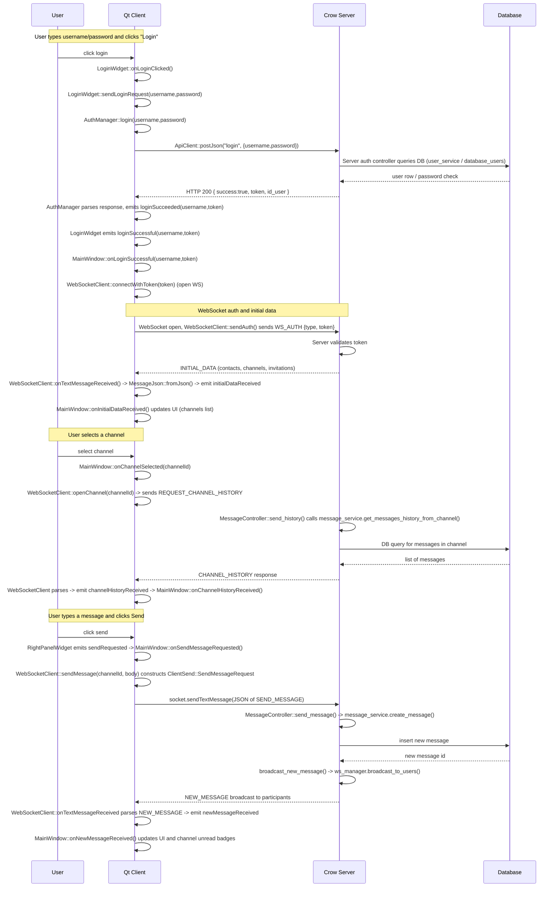

**Résumé**

- But : décrire les flux de données entre le client (Qt) et le serveur (Crow + DB), les points d'entrée/sortie et les traitements effectués quand l'utilisateur utilise l'application.

  

**Composants clés**

- **Client (Qt)**: [client/Sources/ws/websocket_client.cpp](client/Sources/ws/websocket_client.cpp) (WebSocket), [client/Sources/utils/message_json.cpp](client/Sources/utils/message_json.cpp) (sérialisation JSON), [client/Sources/mainwindow.cpp](client/Sources/mainwindow.cpp) (UI / orchestration).

- **Serveur**: [server/sources/server.cpp](server/sources/server.cpp) (routeur WebSocket/HTTP), [server/sources/message/message_controller.cpp](server/sources/message/message_controller.cpp) (logique messages), [server/sources/message/message_service.cpp](server/sources/message/message_service.cpp) (accès BD), [server/headers/json_helpers.hpp](server/headers/json_helpers.hpp) (parse/serialize côté serveur).

- **Schéma / types**: [common/message_structure.hpp](common/message_structure.hpp) et [common/messages.hpp](common/messages.hpp).

  

**Principes généraux**

- Deux transports : HTTP (auth/login) et WebSocket (événements temps réel).

- Messages échangés au format JSON, avec un champ `type` (voir `MessageType` dans `common/messages.hpp`).

- Côté client les structures sont sérialisées via `MessageJson::toJson(…)`; côté client elles sont parsées via `MessageJson::fromJson(…)`.

  

**Flux principaux (séquences simplifiées)**

  

- **Login (initial)**

  - Déclencheur (client) : formulaire de login → `POST /login` (HTTP).  

  - Endpoint serveur : handler HTTP dans `server/sources/server.cpp` → vérification en base (accès via `message_service` / `user_service`).  

  - Traitement : validation, génération de `token`.  

  - Réponse : HTTP JSON { success, token, id_user, … } → client reçoit et stocke `token`.

  - Suite : client ouvre le WebSocket et envoie un message WS de type `WS_AUTH` contenant le `token`.

  

- **WebSocket auth + initial data**

  - Déclencheur (client) : ouverture WS puis envoi `WS_AUTH` (via `WebSocketClient::sendAuth()` / `message_json`).  

  - Endpoint serveur : lecture du message dans `server/sources/server.cpp`, vérification token, then send `INITIAL_DATA` (contacts, channels, invitations).  

  - Traitement : le serveur assemble `InitialDataResponse` (via `ServerSendHelpers::to_json`) et l'envoie au client.

  - Résultat client : `initialDataReceived` (signal) → `MainWindow::onInitialDataReceived()` met à jour UI (channel list, invitations).

  

- **Ouvrir une conversation / charger l'historique**

  - Déclencheur : sélection de canal dans l'UI → client envoie `REQUEST_CHANNEL_HISTORY` (via `WebSocketClient::openChannel`).

  - Serveur : `MessageController::send_history()` appelle `message_service.get_messages_history_from_channel()` (BD) puis renvoie `CHANNEL_HISTORY`.

  - Client : parse `ChannelHistoryResponse`, `onChannelHistoryReceived()` affiche messages, puis envoie un `MARK_AS_READ` si nécessaire.

  

- **Envoyer un message (envoi temps réel)**

  - Déclencheur (client) : utilisateur envoie texte → `WebSocketClient::sendMessage()` envoie `SEND_MESSAGE`.

  - Serveur : `MessageController::send_message()` valide l'accès, stocke message (`message_service.create_message()`), puis appelle `broadcast_new_message()` qui fait `ws_manager.broadcast_to_users()` pour tous les participants.

  - Client(s) : reçoivent `NEW_MESSAGE`, `onNewMessageReceived()` met à jour la vue et les badges de non lus.

  

- **Marquer comme lu (MARK_AS_READ)**

  - Déclencheur (client) : ouverture du canal ou lecture → `WebSocketClient::markAsRead()` envoie `MARK_AS_READ`.

  - Serveur : `MessageController::mark_as_read()` parse la requête (`JsonHelpers::ClientSendHelpers::parse_mark_as_read`), met à jour la BD (`message_service.mark_as_read`), calcule le `unread_count` et renvoie un objet (ou l'envoie aux devices de l'utilisateur) contenant `id_channel`, `last_id_message`, `unread_count`.

  - Client : parse la notification `MARK_AS_READ` et met à jour l'interface (badges) — implémentation côté client dans `WebSocketClient::onTextMessageReceived()` émet `markAsReadReceived`, géré par `MainWindow::onMarkAsReadReceived()`.

  

- **Invitations (accept / reject)**

  - Déclencheur : utilisateur clique accepter/refuser → client envoie `ACCEPT_INVITATION` ou `REJECT_INVITATION`.

  - Serveur : `parse_accept_invitation` / `parse_reject_invitation` → `message_controller` / `invitation_service` effectuent modifications en BD et envoient notifications (`INVITATION_ACCEPTED`, `INVITATION_REJECTED` ou `CHANNEL_CREATED`).

  - Client : reçoit notification et met à jour la liste de canaux/invitations.

  

- **Erreurs**

  - Le serveur renvoie `ERROR` (type 255) quand un parsing/autorisation/erreur interne survient. Client affiche une alerte via `errorReceived`.

  

**Où passent les données (mapping fichiers → fonction)**

- Client JSON sérialisation/parsing : `client/Sources/utils/message_json.cpp` ↔ déclarations dans `common/message_structure.hpp`.

- Envoi/Reception WS client : `client/Sources/ws/websocket_client.cpp` (connect, sendTextMessage, textMessageReceived parsing, émettre signaux vers UI).

- UI / orchestration : `client/Sources/mainwindow.cpp` (réception signaux, mise à jour ChannelPanel/RightPanel).

- Serveur réception/dispatch : `server/sources/server.cpp` (route WebSocket), `server/headers/json_helpers.hpp` (parsing/to_json côté serveur), controllers dans `server/sources/*_controller.cpp`.

- Traitement métier / BD : `server/sources/*_service.cpp` (ex : `message_service.cpp`) qui effectue les requêtes SQL et la logique de mise à jour.

  

**Conseils rapides pour debug / extension**

- Pour suivre un flux : activer logs côté client (`QT_LOGGING_RULES`) et vérifier sorties serveur (`docker compose logs -f server`).

- Pour ajouter un nouveau message type : 1) ajouter enum dans `common/messages.hpp`, 2) ajouter structure dans `common/message_structure.hpp`, 3) ajouter parsers/sérializers côté serveur (`json_helpers.hpp`) et côté client (`message_json.cpp/.hpp`), 4) ajouter handling côté serveur (controller/service) et côté client (WebSocket handler + UI signal/slot).

  

**Fichier à consulter en priorité**

- [client/Sources/ws/websocket_client.cpp](client/Sources/ws/websocket_client.cpp)

- [client/Sources/utils/message_json.cpp](client/Sources/utils/message_json.cpp)

- [client/Sources/mainwindow.cpp](client/Sources/mainwindow.cpp)

- [server/sources/server.cpp](server/sources/server.cpp)

- [server/sources/message/message_controller.cpp](server/sources/message/message_controller.cpp)

- [server/sources/message/message_service.cpp](server/sources/message/message_service.cpp)

- [server/headers/json_helpers.hpp](server/headers/json_helpers.hpp)

- [common/message_structure.hpp](common/message_structure.hpp)

- [common/messages.hpp](common/messages.hpp)

  

## Sequence: Login → Open Channel → Send Message

  

